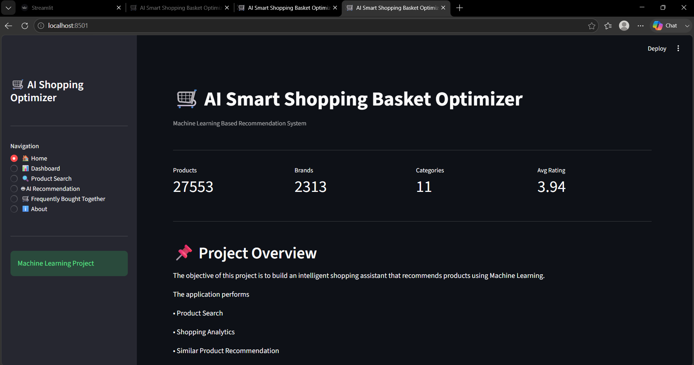
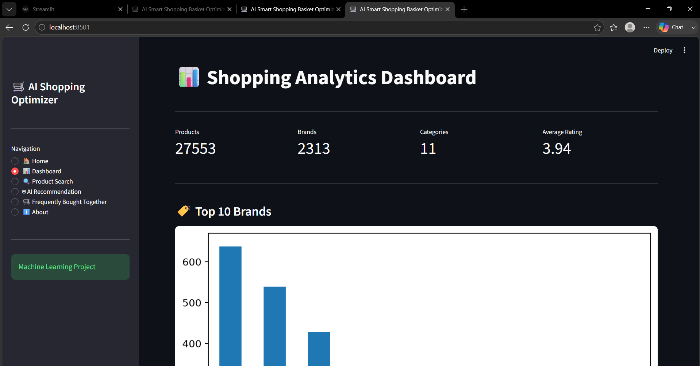
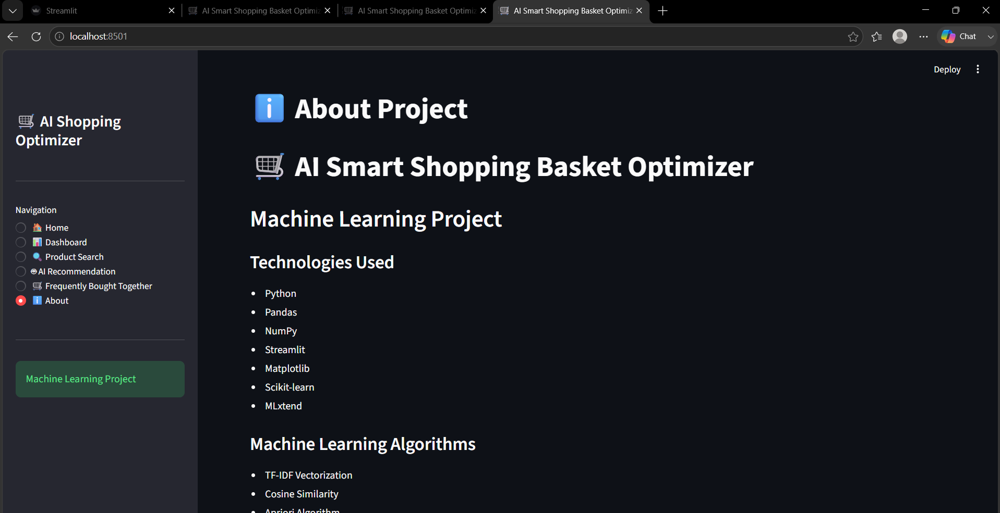

---
# 🛒 AI Smart Shopping Basket Optimizer


[](https://wxmtyingcsm2niasblbx83.streamlit.app/)
A Machine Learning based Smart Shopping Recommendation System developed using Python and Streamlit.

## 🚀 Features

- 🔍 Product Search
- 📊 Shopping Analytics Dashboard
- 🤖 AI Product Recommendation (TF-IDF + Cosine Similarity)
- 🛒 Frequently Bought Together (Apriori Algorithm)
- ⭐ Product Rating & Price Details
- 📈 Interactive Dashboard

---

## 🧠 Machine Learning Algorithms

### 1. TF-IDF + Cosine Similarity
- Content-Based Product Recommendation
- Finds similar products based on product information

### 2. Apriori Algorithm
- Market Basket Analysis
- Frequently Bought Together Recommendations
- Association Rule Mining

---

## 🛠️ Technologies Used

- Python
- Pandas
- NumPy
- Streamlit
- Matplotlib
- Scikit-learn
- MLxtend

---

## 📂 Project Structure

```text
AI-Smart-Shopping-Basket-Optimizer/
│
├── app.py
├── dashboard.py
├── recommender.py
├── utils.py
├── market_basket.py
├── requirements.txt
├── README.md
│
├── data/
│   ├── raw/
│   └── processed/
```

---

## 📊 Dataset

- BigBasket Product Dataset
- Online Retail II Dataset

---

## ▶️ How to Run

### Clone Repository

```bash
git clone <YOUR_GITHUB_REPOSITORY_URL>
```

### Install Dependencies

```bash
pip install -r requirements.txt
```

### Run Application

```bash
streamlit run app.py
```

---
## 🏗️ Project Architecture
## 🌐 Live Demo

🚀 **Try the Application Online**

https://wxmtyingcsm2niasblbx83.streamlit.app/

```mermaid
flowchart TD

    A[👤 User] --> B[🛒 Streamlit Web Application]

    B --> C[📊 Dashboard]
    B --> D[🔍 Product Search]
    B --> E[🤖 AI Recommendation]
    B --> F[🛒 Frequently Bought Together]

    D --> G[(BigBasket Dataset)]

    E --> H[TF-IDF Vectorizer]
    H --> I[Cosine Similarity]
    I --> J[Recommended Products]

    F --> K[(Online Retail Dataset)]
    K --> L[Apriori Algorithm]
    L --> M[Association Rules]
    M --> N[Frequently Bought Products]

    J --> O[🎯 Final Recommendation]

    N --> O
```

## 📸 Screenshots

### 🏠 Home Page



---

### 📊 Dashboard



---

### 🔍 Product Search


---

### 🤖 AI Recommendation


---

### 🛒 Frequently Bought Together


---

### ℹ️ About



---

## 🌐 Live Demo

🚀 **Try the Application Online**

https://wxmtyingcsm2niasblbx83.streamlit.app/

---

## 👩‍💻 Developed By

**Sampada Thombare**

Bachelor of Engineering (B.E.)

Data Science & Machine Learning Enthusiast